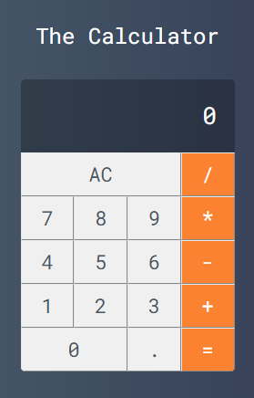

The Calculator Project

A simple project built with vite using vue as template to pratice some concepts and fixing some methods of this awesome frameworks, the VueJs

Basic Features:

- Sum
- Subtraction
- Multiplication
- Division

Is allowed the use of the float numbers, it's basic, but functional

This project was built joining the Cod3r - VuejS Course!!
